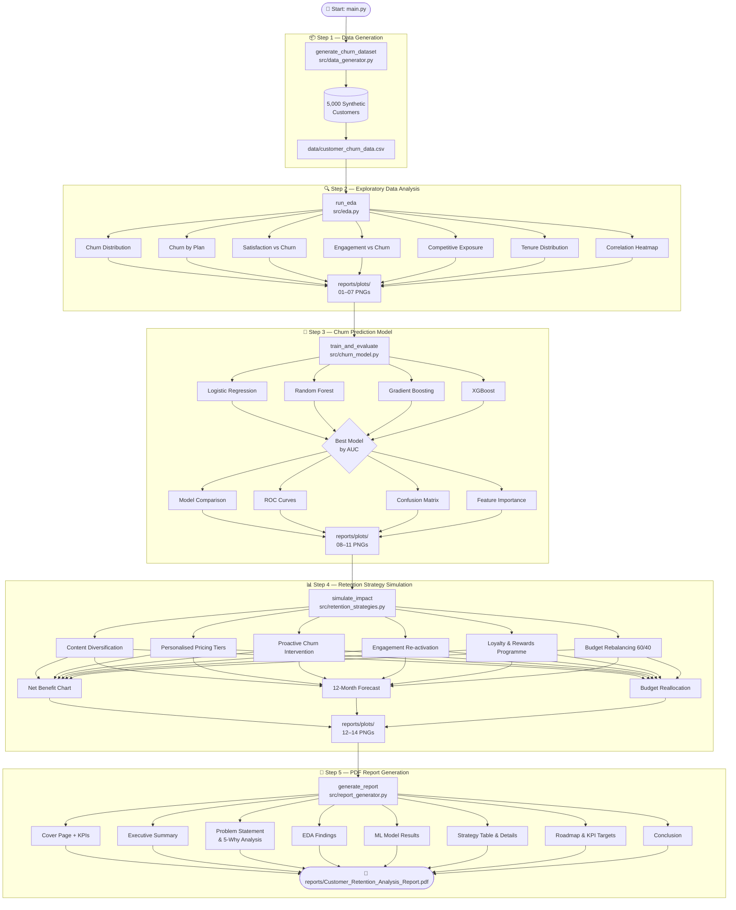

# 📉 Customer Churn Analysis & Retention Strategy

[](https://www.python.org/)
[](https://scikit-learn.org/)
[](https://xgboost.readthedocs.io/)
[](https://pandas.pydata.org/)
[](https://py-pdfkit.readthedocs.io/)
[](LICENSE)
[](https://github.com/SANJAI-s0/customer-churn-analysis-retention-strategy)

> An end-to-end data science pipeline that analyses customer churn for a subscription-based streaming service, trains ML churn prediction models, simulates evidence-based retention strategies, and auto-generates a professional PDF report — all from a single `python main.py` command.

---

## 📋 Table of Contents

- [Problem Statement](#-problem-statement)
- [Project Highlights](#-project-highlights)
- [Project Structure](#-project-structure)
- [Pipeline Workflow](#-pipeline-workflow)
- [Dataset](#-dataset)
- [Exploratory Data Analysis](#-exploratory-data-analysis)
- [Churn Prediction Models](#-churn-prediction-models)
- [Retention Strategies](#-retention-strategies)
- [Results](#-results)
- [Generated Report](#-generated-report)
- [Getting Started](#-getting-started)
- [.gitignore](#-gitignore)
- [Requirements](#-requirements)
- [License](#-license)

---

## 🎯 Problem Statement

A mid-sized subscription-based streaming service is experiencing a **15% increase in churn rate** year-over-year despite steady growth in new customer acquisition. The current marketing budget is skewed **80% toward acquisition and only 20% toward retention**.

Key challenges:
1. Identifying the root causes of customer churn
2. Balancing investment between acquisition and retention for maximum profitability
3. Developing actionable strategies to reduce churn while maintaining operational efficiency

**Goal:** Improve customer retention by at least **20% within 12 months** using a structured, evidence-based framework.

---

## ✨ Project Highlights

- 🔄 **Fully automated pipeline** — one command runs all 5 stages end-to-end
- 🧪 **Synthetic dataset** — 5,000 customers with realistic churn signals (engagement, satisfaction, competitive exposure)
- 📊 **14 EDA & model plots** — saved automatically to `reports/plots/`
- 🤖 **4 ML classifiers** — Logistic Regression, Random Forest, Gradient Boosting, XGBoost with 5-fold CV
- 📈 **6 retention strategies** — each with ROI, net benefit, and time-to-impact simulation
- 📄 **Auto-generated PDF report** — professional 15+ page report with cover page, charts, tables, and roadmap

---

## 📁 Project Structure

```
customer-churn-analysis-retention-strategy/
│
├── Flow/
│   └── workflow.mmd                  # Mermaid pipeline workflow diagram
│
├── src/
│   ├── __init__.py
│   ├── data_generator.py             # Synthetic dataset generation
│   ├── eda.py                        # Exploratory data analysis + plots
│   ├── churn_model.py                # ML model training & evaluation
│   ├── retention_strategies.py       # Strategy simulation & forecasting
│   └── report_generator.py          # PDF report builder (fpdf2)
│
├── data/
│   └── customer_churn_data.csv       # Generated dataset (5,000 rows) [git-ignored]
│
├── reports/
│   ├── plots/                        # All 14 generated charts (PNG) [git-ignored]
│   └── Customer_Retention_Analysis_Report.pdf  [git-ignored]
│
├── Project/
│   └── Problem Statement.pdf         # Original assignment brief
│
├── main.py                           # Pipeline orchestrator
├── requirements.txt
├── .gitignore
└── LICENSE                           # MIT License
```

---

## 🔀 Pipeline Workflow

The diagram below shows the full 5-stage pipeline. View it in any Mermaid-compatible renderer (GitHub, VS Code with Mermaid extension, [mermaid.live](https://mermaid.live)).

> 📄 Source: [`Flow/workflow.mmd`](Flow/workflow.mmd)



---

## 📦 Dataset

The synthetic dataset is generated by `src/data_generator.py` and saved to `data/customer_churn_data.csv`.

| Feature | Type | Description |
|---|---|---|
| `customer_id` | string | Unique customer identifier |
| `age` | int | Customer age (18–70) |
| `tenure_months` | int | Months subscribed (1–60) |
| `plan` | categorical | basic / standard / premium |
| `monthly_charge` | float | Monthly subscription fee ($) |
| `avg_watch_hours_per_week` | float | Average weekly watch hours |
| `login_frequency_per_month` | int | Monthly login count |
| `content_searches_per_month` | int | Monthly content search count |
| `content_satisfaction` | int | Satisfaction score 1–5 |
| `price_satisfaction` | int | Satisfaction score 1–5 |
| `support_satisfaction` | int | Satisfaction score 1–5 |
| `uses_competitor` | binary | Uses a competing service (0/1) |
| `received_competitor_offer` | binary | Received competitor promo (0/1) |
| `support_tickets_last_3m` | int | Support tickets in last 3 months |
| `payment_failures_last_3m` | int | Payment failures in last 3 months |
| `received_discount` | binary | Received a discount (0/1) |
| `discount_amount` | float | Discount value ($) |
| `churned` | binary | **Target** — 1 = churned, 0 = retained |

Churn probability is modelled using a logistic-style weighted score combining all features, producing a realistic class distribution.

---

## 🔍 Exploratory Data Analysis

`src/eda.py` generates 7 plots covering all key churn dimensions:

| Plot | File | Insight |
|---|---|---|
| Churn Distribution | `01_churn_distribution.png` | Overall churned vs retained split |
| Churn by Plan | `02_churn_by_plan.png` | Basic plan has highest churn rate |
| Satisfaction vs Churn | `03_satisfaction_vs_churn.png` | Price dissatisfaction is the top driver |
| Engagement vs Churn | `04_engagement_vs_churn.png` | Low watch hours = strong churn signal |
| Competitive Exposure | `05_competitive_exposure.png` | Competitor users churn at ~2x rate |
| Tenure Distribution | `06_tenure_distribution.png` | Early-tenure customers are highest risk |
| Correlation Heatmap | `07_correlation_heatmap.png` | Feature inter-relationships |

**Key findings:**
- Customers with price satisfaction score ≤ 2 churn at 2–3× the rate of satisfied customers
- Customers exposed to competitor offers show significantly elevated churn
- Low engagement (< 2 hrs/week) is a reliable early warning signal
- New subscribers (< 6 months tenure) are the most vulnerable segment

---

## 🤖 Churn Prediction Models

`src/churn_model.py` trains and evaluates four classifiers using **5-fold stratified cross-validation**:

| Model | CV AUC | Test AUC |
|---|---|---|
| Logistic Regression | 0.6219 ± 0.0172 | **0.6531** |
| Random Forest | 0.5956 ± 0.0221 | 0.6174 |
| Gradient Boosting | 0.5977 ± 0.0179 | 0.5944 |
| XGBoost | 0.5685 ± 0.0176 | 0.5918 |

**Best model: Logistic Regression** (AUC = 0.6531)

Top churn predictors (by feature importance):
1. `price_satisfaction`
2. `content_satisfaction`
3. `uses_competitor`
4. `avg_watch_hours_per_week`
5. `received_competitor_offer`

Generated plots: model comparison bar chart, ROC curves, confusion matrix, feature importance.

---

## 📊 Retention Strategies

`src/retention_strategies.py` simulates 6 evidence-based strategies, each targeting a specific churn driver:

| Strategy | Churn Reduction | Complexity | Time to Impact | Target Segment |
|---|---|---|---|---|
| Content Diversification | 8% | High | 6 months | Low content satisfaction (≤ 2) |
| Personalised Pricing Tiers | 7% | Medium | 3 months | Low price satisfaction (≤ 2) |
| Proactive Churn Intervention | 6% | Medium | 2 months | Top 20% ML risk score |
| Engagement Re-activation | 4% | Low | 1 month | Watch hours < 2 hrs/week |
| Loyalty & Rewards Programme | 3% | Low | 3 months | Tenure > 12 months |
| Budget Rebalancing (60/40) | 5% | Low | 2 months | All customers |

**Combined impact (multiplicative, accounting for overlap):**
- Baseline churn rate: **61.34%**
- Projected churn rate: **43.64%**
- Total churn reduction: **28.85%** — exceeds the 20% target ✅

### Implementation Roadmap

**Phase 1 — Quick Wins (Month 1–2)**
- Deploy engagement re-activation email/push campaigns
- Activate ML churn scoring; trigger win-back offers for top 20% risk customers
- Begin budget rebalancing: shift 20% of acquisition spend to retention

**Phase 2 — Core Initiatives (Month 3–4)**
- Launch personalised pricing tiers (annual plans, family bundles, ad-supported tier)
- Introduce loyalty & rewards programme for long-tenure customers
- Set up NPS and satisfaction tracking dashboards

**Phase 3 — Strategic Investment (Month 5–6+)**
- Accelerate content diversification with originals in underserved genres
- A/B test pricing changes before full rollout
- Retrain ML model quarterly with new behavioural data

---

## 📈 Results

| Metric | Value |
|---|---|
| Dataset size | 5,000 customers |
| Best model | Logistic Regression |
| Best AUC | 0.6531 |
| Baseline churn rate | 61.34% |
| Projected churn rate | 43.64% |
| Churn reduction achieved | **28.85%** |
| Target (problem statement) | 20% |
| Status | ✅ Target exceeded |

---

## 📄 Generated Report

The pipeline auto-generates a professional PDF report at:

```
reports/Customer_Retention_Analysis_Report.pdf
```

The report includes:
- Cover page with KPI summary
- Executive summary
- Problem statement & 5-Why root cause analysis
- Full EDA with embedded charts
- ML model comparison table & plots
- Retention strategy details, ROI table, and 12-month forecast
- Phased implementation roadmap
- KPI targets & success metrics
- Conclusion

---

## 🚀 Getting Started

**1. Clone the repository**

```bash
git clone https://github.com/SANJAI-s0/customer-churn-analysis-retention-strategy.git
cd customer-churn-analysis-retention-strategy
```

**2. Create and activate a virtual environment**

```bash
python -m venv .venv

# Windows
.venv\Scripts\activate

# macOS / Linux
source .venv/bin/activate
```

**3. Install dependencies**

```bash
pip install -r requirements.txt
```

**4. Run the pipeline**

```bash
python main.py
```

That's it. All outputs are generated automatically:

```
data/customer_churn_data.csv
reports/plots/*.png          (14 charts)
reports/Customer_Retention_Analysis_Report.pdf
```

---

## 🚫 .gitignore

The following are excluded from version control:

| Pattern | Reason |
|---|---|
| `data/*.csv` | Generated at runtime — can be large |
| `reports/plots/*.png` | Generated at runtime |
| `reports/*.pdf` | Generated at runtime |
| `*.pkl`, `*.joblib` | Model artifacts |
| `.venv/`, `venv/` | Virtual environment |
| `.env`, `.env.*` | Secrets / API keys |
| `__pycache__/`, `*.pyc` | Python bytecode |
| `.DS_Store`, `Thumbs.db` | OS metadata |

Run `python main.py` to regenerate all data, plots, and the PDF report locally.

---

## 📦 Requirements

```
pandas==2.2.2
numpy==1.26.4
scikit-learn==1.4.2
matplotlib==3.8.4
seaborn==0.13.2
xgboost==2.0.3
fpdf2==2.7.9
imbalanced-learn==0.12.2
```

Python 3.10+ recommended.

---

## 📜 License

This project is licensed under the [MIT License](LICENSE).

---

<p align="center">
  <a href="https://github.com/SANJAI-s0/customer-churn-analysis-retention-strategy">
    
  </a>
</p>
