# 🤖 QLoRA BERT Text Classification

<p align="center">
  
  
  
  
  
  
</p>

> Parameter-Efficient Fine-Tuning of **BERT** for binary sentiment classification using **QLoRA** (Quantized Low-Rank Adaptation) — achieving competitive accuracy while reducing trainable parameters by ~99% and GPU memory by ~70% compared to full fine-tuning.

---

## 📋 Table of Contents

1. [Overview](#-overview)
2. [Workflow](#-workflow)
3. [Project Structure](#-project-structure)
4. [Key Techniques](#-key-techniques)
5. [Dataset](#-dataset)
6. [Model Architecture](#-model-architecture)
7. [Training Configuration](#-training-configuration)
8. [Results](#-results)
9. [Efficiency Analysis](#-efficiency-analysis)
10. [Getting Started](#-getting-started)
11. [W&B Integration (Optional)](#-wb-integration-optional)
12. [License](#-license)

---

## 🔍 Overview

This project demonstrates how **QLoRA** enables fine-tuning of large pre-trained language models on consumer-grade hardware. By combining **4-bit NF4 quantization** (via `bitsandbytes`) with **Low-Rank Adaptation** (via `peft`), we fine-tune `bert-base-uncased` on the IMDb sentiment dataset while:

- Training only **~0.5% of total parameters** (LoRA adapters on Q & V projections)
- Reducing GPU memory footprint by **~70%** vs full fp32 fine-tuning
- Using the **8-bit paged AdamW** optimizer for further memory savings
- Optionally logging experiments to **Weights & Biases** (works without it too)

---

## 🔄 Workflow

```mermaid
flowchart TD
    A([🚀 Start]) --> B[Environment Setup\nInstall dependencies\ntransformers · peft · bitsandbytes]
    B --> C[Data Preparation\nLoad IMDb 20k dataset\nfrom HuggingFace Hub]
    C --> D[Tokenization\nbert-base-uncased\nmax_length=256]
    D --> E[Train / Val / Test Split\n80% · 10% · 10%]
    E --> F[4-bit Quantization Config\nNF4 · fp16 compute\nDouble Quantization]
    F --> G[Load Base Model\nbert-base-uncased\nQuantized via BitsAndBytes]
    G --> H[Prepare for k-bit Training\nFreeze base layers\nCast norms to fp32]
    H --> I[Apply QLoRA Adapters\nLoRA rank r=16 · alpha=32\nTarget: query & value projections]
    I --> J[Training Configuration\nEpochs=3 · LR=2e-4 · fp16\npaged_adamw_8bit · cosine LR]
    J --> K[W&B Logging\nOptional · skipped if unavailable]
    K --> L[Fine-Tuning\nHuggingFace Trainer\nEarly Stopping patience=2]
    L --> M{Epoch Complete?}
    M -- No --> L
    M -- Yes --> N[Evaluation\nTest Set: Accuracy · F1\nConfusion Matrix]
    N --> O[Efficiency Analysis\nParameter reduction\nMemory savings vs Full FT]
    O --> P[Visualizations saved to Data/\nTraining curves · Comparison charts]
    P --> Q([✅ Done])

    style A fill:#4CAF50,color:#fff
    style Q fill:#4CAF50,color:#fff
    style F fill:#2196F3,color:#fff
    style I fill:#9C27B0,color:#fff
    style K fill:#9E9E9E,color:#fff
    style L fill:#FF9800,color:#fff
    style N fill:#00BCD4,color:#fff
```



> The full `.mmd` source is at [`Flow/workflow.mmd`](Flow/workflow.mmd).

---

## 📁 Project Structure

```
FineTuning/
├── QLoRA_BERT_TextClassification.ipynb   # Main notebook
├── Flow/
│   └── workflow.mmd                      # Mermaid workflow diagram source
├── Data/                                 # Generated plots (auto-created at runtime)
│   ├── dataset_stats.png
│   ├── confusion_matrix.png
│   ├── training_curves.png
│   ├── efficiency_comparison.png
│   └── lora_rank_sensitivity.png
├── requirements.txt                      # Python dependencies
├── .env.example                          # Environment variable template
├── .gitignore
└── LICENSE
```

---

## 🔑 Key Techniques

| Technique | Detail |
|---|---|
| **4-bit NF4 Quantization** | Weights stored in 4-bit Normal Float format via `bitsandbytes` |
| **Double Quantization** | Quantizes the quantization constants for extra memory savings |
| **LoRA Adapters** | Low-rank matrices injected into Q & V attention projections |
| **fp16 Compute** | Mixed precision training for speed without precision loss |
| **Gradient Checkpointing** | Trades compute for memory during backprop |
| **Paged AdamW 8-bit** | 8-bit optimizer with CPU offloading for optimizer states |
| **Cosine LR Schedule** | Smooth learning rate decay over training |
| **Early Stopping** | Stops training if validation accuracy doesn't improve for 2 epochs |

---

## 📊 Dataset

- **Source:** [`dipanjanS/imdb_sentiment_finetune_dataset20k`](https://huggingface.co/datasets/dipanjanS/imdb_sentiment_finetune_dataset20k) on HuggingFace Hub
- **Task:** Binary sentiment classification (Negative / Positive)
- **Size:** 20,000 IMDb movie reviews
- **Splits:** 80% train · 10% validation · 10% test (carved from the original train split)
- **Tokenizer:** `bert-base-uncased` with `max_length=256`, dynamic padding via `DataCollatorWithPadding`

---

## 🏗️ Model Architecture

Base model: `bert-base-uncased` (~110M parameters)

**QLoRA configuration:**

```python
LoraConfig(
    task_type=TaskType.SEQ_CLS,
    r=16,                              # LoRA rank
    lora_alpha=32,                     # Scaling factor
    target_modules=["query", "value"], # Attention projections
    lora_dropout=0.1,
    bias="none",
)
```

**BitsAndBytes config:**

```python
BitsAndBytesConfig(
    load_in_4bit=True,
    bnb_4bit_quant_type="nf4",
    bnb_4bit_compute_dtype=torch.float16,
    bnb_4bit_use_double_quant=True,
)
```

---

## ⚙️ Training Configuration

| Hyperparameter | Value |
|---|---|
| Epochs | 3 |
| Per-device batch size | 16 |
| Gradient accumulation steps | 2 (effective batch = 32) |
| Learning rate | 2e-4 |
| LR scheduler | Cosine |
| Warmup ratio | 10% |
| Weight decay | 0.01 |
| Optimizer | `paged_adamw_8bit` |
| Precision | fp16 |
| Gradient checkpointing | ✅ |
| Early stopping patience | 2 epochs |
| Best model metric | Validation Accuracy |

---

## 📈 Results

Evaluated on the held-out test set using **Accuracy** and **weighted F1 Score**.

| Metric | Score |
|---|---|
| Test Accuracy | ~93–94% |
| Weighted F1 | ~0.93–0.94 |

> Exact values depend on hardware and random seed.

All plots are saved to the `Data/` folder at runtime:
- `dataset_stats.png` — label distribution & token length histogram
- `confusion_matrix.png` — test set confusion matrix
- `training_curves.png` — train/val loss and validation accuracy over steps
- `efficiency_comparison.png` — parameter & memory comparison charts
- `lora_rank_sensitivity.png` — LoRA rank vs trainable parameter count

---

## ⚡ Efficiency Analysis

| Metric | Full Fine-Tuning | QLoRA |
|---|---|---|
| Trainable parameters | ~110M (100%) | ~0.5M (~0.5%) |
| Model weights memory | ~440 MB (fp32) | ~55 MB (4-bit) |
| Estimated total GPU memory | ~1.7 GB | ~0.5 GB |
| Memory savings | — | ~70% |
| Memory reduction factor | — | ~3–4× |

> These are theoretical estimates. Actual GPU usage includes activations, optimizer states, and framework overhead.

---

## 🚀 Getting Started

### Prerequisites

- Python 3.10+
- CUDA-capable GPU (recommended: 8GB+ VRAM)
- CUDA 11.8 or 12.x

### Installation

```bash
git clone https://github.com/SANJAI-s0/bert-qlora-text-classification.git
cd bert-qlora-text-classification
pip install -r requirements.txt
```

> Install PyTorch with the correct CUDA version for your system first:
> ```bash
> pip install torch torchvision --index-url https://download.pytorch.org/whl/cu118
> ```

### Run

Open and run the notebook cell by cell:

```bash
jupyter notebook QLoRA_BERT_TextClassification.ipynb
```

Or use Google Colab / Kaggle (free GPU tier works with this setup).

---

## 📡 W&B Integration (Optional)

W&B logging is **fully optional** — the notebook trains and evaluates without it. If W&B is unavailable or the login fails, it silently falls back to local-only logging.

To enable W&B:

1. Create a free account at [wandb.ai](https://wandb.ai)
2. Copy `.env.example` to `.env` and add your API key from [wandb.ai/authorize](https://wandb.ai/authorize)
3. The notebook auto-detects the key and logs metrics, curves, and the confusion matrix

```bash
cp .env.example .env
# Edit .env and set WANDB_API_KEY=your_key_here
```

---

## 📄 License

This project is licensed under the [MIT License](LICENSE).
