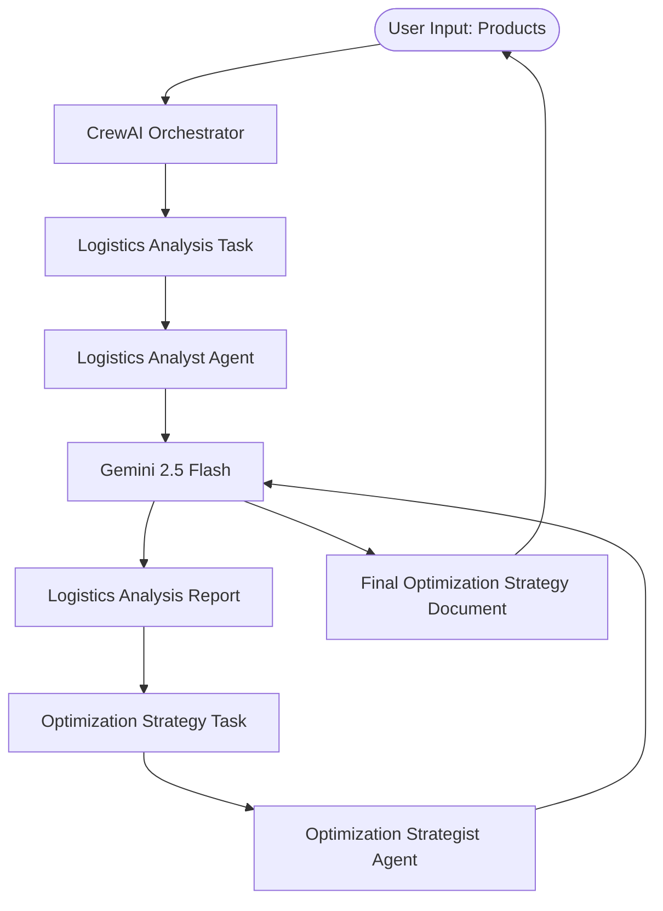

# 🚢 Logistics Optimization Analysis — CrewAI

[](https://github.com/SANJAI-s0/logistics-optimization-crewai/blob/main/LICENSE)
[](https://www.python.org/downloads/)
[](https://www.crewai.com/)
[](https://deepmind.google/technologies/gemini/)
[](https://github.com/SANJAI-s0/logistics-optimization-crewai)
[](https://github.com/SANJAI-s0/logistics-optimization-crewai/commits/main)

A high-performance multi-agent system built on **CrewAI** that automates the analysis and optimization of logistics operations. By leveraging collaborative AI agents powered by **Google Gemini 2.5 Flash**, the system identifies supply chain bottlenecks and generates actionable, data-driven optimization strategies.

---

## 📖 Table of Contents

- [Overview](#-overview)
- [Agentic Workflow](#-agentic-workflow)
- [Key Features](#-key-features)
- [Tech Stack](#-tech-stack)
- [Project Structure](#-project-structure)
- [Installation & Setup](#-installation--setup)
- [Usage Guide](#-usage-guide)
- [License](#-license)

---

## 🌟 Overview

The **Logistics Optimization Analysis** system move beyond simple data processing. It simulates a professional supply chain team where specialized agents collaborate to solve complex logistics problems. 

The system takes a list of products as input and processes them through a multi-stage pipeline to produce a comprehensive optimization strategy that covers route efficiency, inventory turnover, and KPI improvements.

---

## 🏗️ Agentic Workflow

The system employs a sequential process where output from the analytical phase directly informs the strategic phase.



---

## 🛠️ Key Features

- **🤖 Multi-Agent Collaboration:** Sequential delegation between a Logistics Analyst and an Optimization Strategist.
- **⚡ Flash-Speed Reasoning:** Powered by Gemini 2.5 Flash for rapid analysis and strategy generation.
- **📈 Comprehensive Analysis:** Covers route efficiency, last-mile delivery, and inventory turnover trends.
- **📋 Actionable Strategies:** Delivers prioritized plans with effort/impact ratings and estimated KPI gains.
- **🔄 Parametric Execution:** Tailor analysis to any product mix (e.g., electronics, perishables, automotive).

---

## 💻 Tech Stack

- **Orchestration:** [CrewAI](https://www.crewai.com/)
- **LLM:** [Google Gemini 2.5 Flash](https://aistudio.google.com/)
- **Language:** Python 3.10+
- **Environment:** `python-dotenv` for secret management

---

## 📂 Project Structure

```bash
Logistics_Optimization_Analysis-Crew_AI/
├── Flow/                  # Workflow diagrams (.mmd)
│   └── workflow.mmd
├── .env                   # Private API keys
├── .env.example           # Environment template
├── .gitignore             # Git exclusions
├── LICENSE                # MIT License
├── logistics_crew.py      # Main CrewAI implementation
├── README.md              # Project documentation
└── requirements.txt       # Dependencies
```

---

## ⚙️ Installation & Setup

### 1. Clone the Repository
```bash
git clone https://github.com/SANJAI-s0/logistics-optimization-crewai.git
cd logistics-optimization-crewai
```

### 2. Prepare Environment
```bash
# Create virtual environment
python -m venv venv
source venv/bin/activate  # Windows: venv\Scripts\activate

# Install dependencies
pip install -r requirements.txt
```

### 3. Configure API Keys
1. Get your Gemini API Key from [Google AI Studio](https://aistudio.google.com/).
2. Setup environment:
   ```bash
   cp .env.example .env
   ```
3. Edit `.env` and add your key:
   ```env
   GEMINI_API_KEY=your_gemini_api_key_here
   ```

---

## 🚀 Usage Guide

Launch the analysis system:
```bash
python logistics_crew.py
```

### Sample Input:
When prompted, enter your target products:
```text
Enter the products to optimise (comma-separated):
> pharmaceuticals, cold-chain food, consumer electronics
```

### Expected Output:
The agent will output two main documents:
1. **Logistics Analysis Report**: A deep dive into current inefficiencies and turnover trends.
2. **Optimization Strategy**: A prioritized roadmap for improvement with estimated KPI impacts.

---

## 📜 License

Distributed under the MIT License. See [LICENSE](LICENSE) for more information.

---

<p align="center">
  Built with 🤖 by <a href="https://github.com/SANJAI-s0">Sanjai S0</a>
</p>
