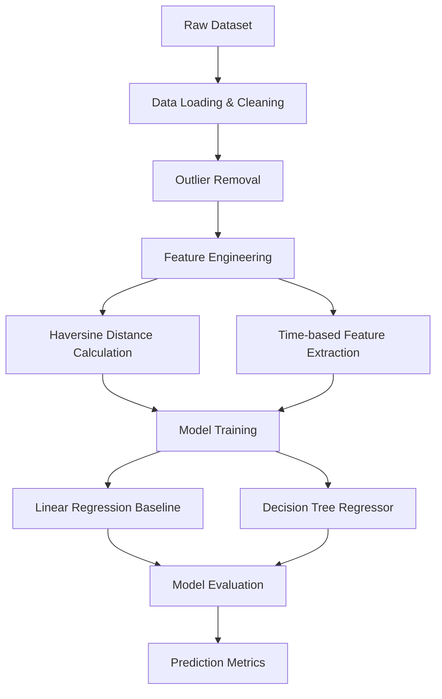

# 🚕 NYC Taxi Trip Duration Prediction


Predicting the duration of taxi trips in New York City using regression and decision tree models. This project is useful for taxi dispatch systems to identify when a driver will be finishing their current ride.

---

## 🌟 Key Features
- **Automatic Data Setup**: The notebook handles directory creation and dataset downloading automatically from GitHub.
- **Geospatial Analysis**: Uses Haversine formula to calculate real-world distance between coordinates.
- **Temporal Analysis**: Extracts hour, day, and month to account for traffic cyclicality.
- **Advanced Modeling**: Compares linear baselines with non-linear tree-based regressors.

---

## 📖 Table of Contents
1. [Project Overview](#project-overview)
2. [Workflow](#workflow)
3. [Dataset Description](#dataset-description)
4. [Methodology](#methodology)
   - [Data Cleaning](#data-cleaning)
   - [Feature Engineering](#feature-engineering)
5. [Model Building & Evaluation](#model-building--evaluation)
   - [Baseline Model (Linear Regression)](#baseline-model-linear-regression)
   - [Advanced Model (Decision Tree)](#advanced-model-decision-tree)
6. [Results](#results)
7. [Installation](#installation)
8. [License](#license)

---

## 📁 Project Structure
```text
NYC_Taxi_Prediction/
├── Flow/
│   └── workflow.mmd
├── Dataset/
│   └── (nyc_taxi_trip_duration.csv)
├── README.md
└── NYC_Taxi_Trip_Duration_Prediction.ipynb
```

---

## 🧩 Workflow
Below is the machine learning pipeline used for this project:



---

## 📊 Dataset Description
The [NYC Trip Duration dataset](https://github.com/SANJAI-s0/NYC_Taxi_Prediction/blob/main/Dataset/nyc_taxi_trip_duration.csv) contains records of taxi trips including:
- **id**: Trip ID
- **vendor_id**: Provider code
- **pickup/dropoff_datetime**: Engagement/Disengagement timestamps
- **passenger_count**: Number of passengers
- **latitude/longitude**: Pickup and dropoff locations
- **trip_duration**: The target variable in seconds

---

## 🧹 Methodology

### Data Cleaning
- Handled outliers where `trip_duration` exceeded 5 hours or was less than 1 minute.
- Filtered coordinates to keep trips within a geographical bounding box.
- Removed records with 0 distance trips.

### Feature Engineering
- **Haversine Distance**: Formulated the distance between pickup and dropoff points in kilometers.
- **Time Features**: Extracted `hour`, `day_of_week`, and `month` from the `pickup_datetime`.
- **Log Transformation**: Applied `log1p` to the target variable to reduce skewness and manage large range of values.

---

## 🤖 Model Building & Evaluation

### Baseline Model (Linear Regression)
Simple model to establish a performance benchmark.
- **Metric**: RMSE (Log-transformed space)

### Advanced Model (Decision Tree)
Captures complex, non-linear relationships such as traffic fluctuations by hour and spatial correlations.
- **Metric**: RMSE (Log-transformed space)

---

## 🏆 Results
After training on over 570,000 samples:

| Model | RMSE (Log Space) | Performance |
|-------|------------------|-------------|
| Linear Regression | 0.74 | Baseline |
| **Decision Tree Regressor** | **0.38** | **Best** |

The Decision Tree model significantly outperformed the linear baseline, proving that spatial and temporal features are non-linear predictors of trip duration.

---

## 🛠 Installation
To run this project, follow these steps:

1. Clone the repository:
   ```bash
   git clone https://github.com/SANJAI-s0/NYC_Taxi_Prediction.git
   cd NYC_Taxi_Prediction
   ```
2. Create and activate a Virtual Environment:
   ```bash
   python -m venv .venv
   source .venv/bin/activate  # On Windows: .venv\Scripts\activate
   ```
3. Install dependencies:
   ```bash
   pip install -r requirements.txt
   ```
4. Open the Jupyter Notebook:
   ```bash
   jupyter notebook NYC_Taxi_Trip_Duration_Prediction.ipynb
   ```

> [!NOTE]
> The notebook will automatically create the `Dataset/` folder and download the ~30MB dataset upon its first execution. No manual file management is required.

---

## 📜 License
This project is licensed under the MIT License - see the LICENSE file for details.
