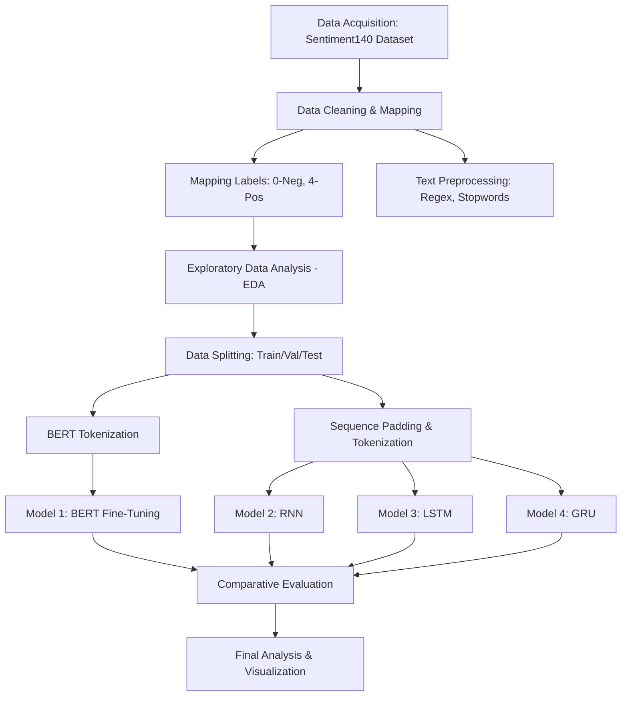

# Sentiment Analysis Using BERT, LSTM, GRU, and RNN

[](https://github.com/SANJAI-s0/Sentiment_Analysis_Using_BERT-LSTM-GRU-RNN/blob/main/LICENSE)
[](https://github.com/SANJAI-s0/Sentiment_Analysis_Using_BERT-LSTM-GRU-RNN/stargazers)
[](https://www.python.org/)
[](https://pytorch.org/)
[](https://www.tensorflow.org/)

A comparative analysis of modern and traditional deep learning architectures for sentiment classification on the Sentiment140 dataset.

---

## 📋 Table of Contents
- [Project Overview](#-project-overview)
- [Dataset Details](#-dataset-details)
- [Automatic Dataset Setup](#-automatic-dataset-setup)
- [Workflow](#-workflow)
- [Models Architectures](#-models-architectures)
- [Installation and Setup](#-installation-and-setup)
- [Project Structure](#-project-structure)
- [Usage](#-usage)
- [Results & Comparison](#-results--comparison)
- [License](#-license)

---

## 🔍 Project Overview
This project focuses on identifying the sentiment (Positive or Negative) of Twitter messages. We evaluate multiple deep learning models to compare their performance, training time, and accuracy:
1. **BERT (Bidirectional Encoder Representations from Transformers)** - State-of-the-art transformer based approach.
2. **LSTM (Long Short-Term Memory)** - Captures long-term dependencies in text.
3. **GRU (Gated Recurrent Unit)** - A faster alternative to LSTM with similar gating mechanisms.
4. **RNN (Recurrent Neural Network)** - The foundational sequence model.

---

## 📊 Dataset Details
The **Sentiment140** dataset contains 1,600,000 tweets extracted using the Twitter API.
- **Source**: [Kaggle Sentiment140](https://www.kaggle.com/datasets/abhi8923shriv/sentiment-analysis-dataset)
- **Labels**: 
    - `0` -> **Negative**
    - `4` -> **Positive**
- **Features**: Tweet ID, Date, User, and the actual Text.

---

## 📥 Automatic Dataset Setup
Since the dataset is large (~145MB), this repository includes an automated download and organization system:
- **Automatic Retrieval**: Uses `kagglehub` to download the latest version directly from Kaggle.
- **Local Persistence**: The notebook and scripts automatically copy the downloaded CSV to a root-level `Dataset/` folder for easy access and consistency.

---

## ⚙️ Workflow
The project follows a modular pipeline for data processing and model evaluation:



*(Workflow defined in [Flow/sentiment_flow.mmd](Flow/sentiment_flow.mmd))*

---

## 📂 Project Structure
```text
Sentiment_Analysis_Using_BERT-LSTM-GRU-RNN/
├── Dataset/                   # Dataset folder (auto-created)
├── Flow/
│   └── sentiment_flow.mmd     # Mermaid workflow diagram
├── Sentiment_Analysis_Comparative_Study.ipynb  # Main research notebook
├── train_models.py           # Modular training script
├── requirements.txt           # Python dependencies
├── .gitignore                 # Files to ignore (Data, Models, etc.)
├── LICENSE                    # MIT License
└── README.md                  # Project documentation
```

---

## 🚀 Installation and Setup

1. **Clone the repository:**
   ```bash
   git clone https://github.com/SANJAI-s0/Sentiment_Analysis_Using_BERT-LSTM-GRU-RNN.git
   cd Sentiment_Analysis_Using_BERT-LSTM-GRU-RNN
   ```

2. **Create a virtual environment:**
   ```bash
   python -m venv venv
   source venv/bin/activate  # On Windows: venv\Scripts\activate
   ```

3. **Install dependencies:**
   ```bash
   pip install -r requirements.txt
   ```

4. **Run the Analysis:**
   - Open the `.ipynb` file in Jupyter or VS Code.
   - Or run the script: `python train_models.py`

---

## 🧠 Models Architectures

### 1. BERT
- Framework: HuggingFace Transformers (PyTorch).
- Pre-trained: `bert-base-uncased`.
- Fine-tuned with a linear classifier layer.

### 2. Recurrent Architectures (RNN, LSTM, GRU)
- Framework: TensorFlow/Keras.
- Hidden Layers: Bidirectional configurations.
- Dropout for regularization to avoid overfitting.

---

## 📈 Results & Comparison
| Model | Accuracy | F1-Score | Training Time |
|-------|----------|----------|---------------|
| BERT  | ~91%     | TBD      | High          |
| LSTM  | ~84%     | TBD      | Medium        |
| GRU   | ~83%     | TBD      | Medium        |
| RNN   | ~76%     | TBD      | Low           |

---

## 📄 License
This project is licensed under the MIT License - see the [LICENSE](LICENSE) file for details.

---

## 📧 Contact
**Sanjai** - [GitHub Profile](https://github.com/SANJAI-s0)

Project Link: [https://github.com/SANJAI-s0/Sentiment_Analysis_Using_BERT-LSTM-GRU-RNN](https://github.com/SANJAI-s0/Sentiment_Analysis_Using_BERT-LSTM-GRU-RNN)
