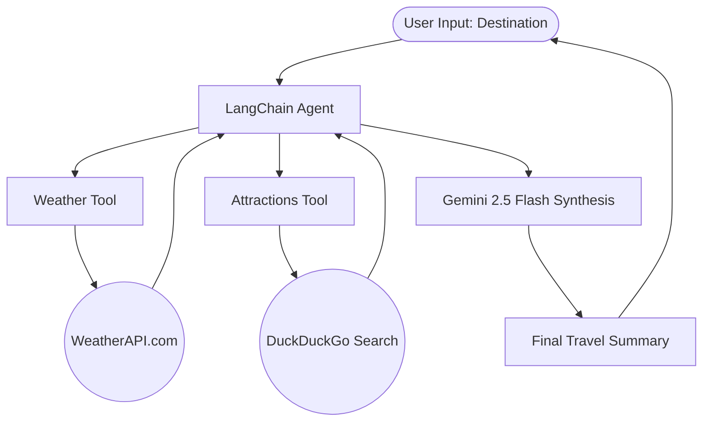

# 🌍 Travel Assistant AI

[](https://github.com/SANJAI-s0/travel-assistant-ai/blob/main/LICENSE)
[](https://www.python.org/downloads/)
[](https://www.langchain.com/)
[](https://deepmind.google/technologies/gemini/)
[](https://github.com/SANJAI-s0/travel-assistant-ai)
[](https://github.com/SANJAI-s0/travel-assistant-ai/commits/main)

An intelligent, multi-tool travel companion built with **LangChain** and **Google Gemini 2.5 Flash**. This assistant provides real-time weather forecasts, 3-day projections, and curated lists of top tourist attractions for any global destination in seconds.

---

## 📖 Table of Contents

- [Overview](#-overview)
- [Workflow Architecture](#-workflow-architecture)
- [Key Features](#-key-features)
- [Tech Stack](#-tech-stack)
- [Project Structure](#-project-structure)
- [Installation & Setup](#-installation--setup)
- [Usage Guide](#-usage-guide)
- [License](#-license)

---

## 🌟 Overview

The **Travel Assistant AI** simplifies trip planning by aggregating essential travel data through an autonomous agent. Instead of browsing multiple tabs for weather and sightseeing, users can simply enter a destination. The agent orchestrates specialized tools to fetch live data and synthesizes a high-quality travel summary using advanced LLM reasoning.

---

## 🏗️ Workflow Architecture

The AI agent follows a structured tool-calling pattern to gather and process destination data:



---

## 🛠️ Key Features

- **☀️ Real-Time Weather:** Current conditions plus a detailed 3-day forecast (High/Low temp, Rain chance).
- **🗼 Landmark Discovery:** Intelligent search for top-rated attractions and hidden gems via DuckDuckGo.
- **🤖 Autonomous Orchestration:** Uses LangChain's tool-calling agent to handle multiple API interactions in parallel.
- **🧠 Natural Language Synthesis:** Gemini 2.5 Flash ensures the final summary is cohesive, professional, and easy to read.
- **🚀 Zero Configuration Search:** Leverages DuckDuckGo for attraction data, requiring no additional API keys.

---

## 💻 Tech Stack

- **Orchestration:** [LangChain](https://www.langchain.com/)
- **Large Language Model:** [Google Gemini 2.5 Flash](https://aistudio.google.com/)
- **Weather Data:** [WeatherAPI](https://www.weatherapi.com/)
- **Search Engine:** DuckDuckGo (via LangChain Community)
- **Language:** Python 3.9+

---

## 📂 Project Structure

```bash
Travel_Assistant_AI/
├── Flow/                  # Workflow diagrams (.mmd)
│   └── workflow.mmd
├── .env                   # Private API keys
├── .env.example           # Shared environment template
├── .gitignore             # Git exclusions
├── LICENSE                # MIT License
├── report.md              # Detailed reasoning/flow explanation
├── travel_assistant.py    # Main AI Agent implementation
├── README.md              # Project documentation
└── requirements.txt       # Dependencies
```

---

## ⚙️ Installation & Setup

### 1. Clone the Repository
```bash
git clone https://github.com/SANJAI-s0/travel-assistant-ai.git
cd travel-assistant-ai
```

### 2. Prepare Environment
```bash
# Create and activate virtual environment
python -m venv venv
source venv/bin/activate  # Windows: venv\Scripts\activate

# Install dependencies
pip install -r requirements.txt
```

### 3. Configure API Keys
1. Get a **Gemini API Key** from [Google AI Studio](https://aistudio.google.com/).
2. Get a free **WeatherAPI Key** from [WeatherAPI.com](https://www.weatherapi.com/).
3. Create your `.env` file:
   ```bash
   cp .env.example .env
   ```
4. Update the keys in `.env`:
   ```env
   GEMINI_API_KEY=your_gemini_key
   WEATHER_API_KEY=your_weather_key
   ```

---

## 🚀 Usage Guide

Launch the assistant:
```bash
python travel_assistant.py
```

### Example Input:
```text
Enter your travel destination: Paris, France
```

### Example Output:
The agent will print a beautifully formatted summary including:
- **Current Weather:** Temp, Condition, Humidity, Wind.
- **Forecast:** Next 3 days with max/min temps and rain probability.
- **Attractions:** Top places like the Eiffel Tower, Louvre Museum, and more.

---

## 📜 License

Distributed under the MIT License. See [LICENSE](LICENSE) for more information.

---

<p align="center">
  Built with 🌍 by <a href="https://github.com/SANJAI-s0">Sanjai S0</a>
</p>
