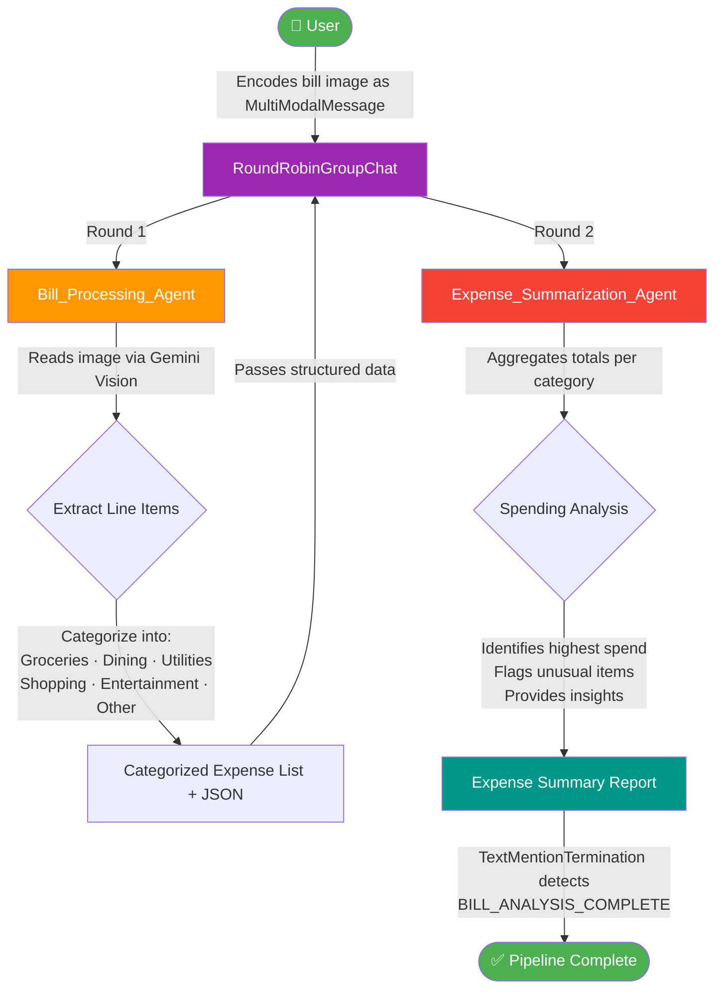

# 🧾 Agentic Expense Tracker

<p align="center">
  
  
  
  
  
</p>

> A multi-agent bill management system that processes receipt images, categorizes expenses, and delivers actionable spending insights — powered by AutoGen AgentChat `RoundRobinGroupChat` and Google Gemini 2.0 Flash vision.

---

## 📋 Table of Contents

- [Overview](#-overview)
- [Features](#-features)
- [Agents & Roles](#-agents--roles)
- [Workflow](#-workflow)
- [Project Structure](#-project-structure)
- [Getting Started](#-getting-started)
  - [Prerequisites](#prerequisites)
  - [Installation](#installation)
  - [Configuration](#configuration)
  - [Usage](#usage)
- [Expected Output](#-expected-output)
- [Tech Stack](#-tech-stack)
- [License](#-license)

---

## 🔍 Overview

The **Agentic Expense Tracker** is a Bill Management Agent that leverages **AutoGen AgentChat 0.7** `RoundRobinGroupChat` to orchestrate multiple AI agents in a sequential pipeline. A receipt image is passed as a multimodal message, and the agent pipeline handles extraction, categorization, and summarization automatically — all powered by Gemini 2.0 Flash vision.

---

## ✨ Features

- 📸 **Vision-based bill processing** — receipt image passed as `MultiModalMessage` with `autogen_core.Image`
- 🗂️ **Automatic categorization** — Groceries, Dining, Utilities, Shopping, Entertainment, Healthcare, Transport, Other
- 📊 **Spending breakdown** — per-category totals with % share and grand total
- 🚨 **Anomaly detection** — flags items exceeding 20% of total spend
- 💡 **Actionable insights** — highlights highest-spend categories and budget health assessment
- 🔄 **Sequential group chat** — `RoundRobinGroupChat` ensures strict agent turn order
- 🛑 **Smart termination** — `TextMentionTermination` stops on `BILL_ANALYSIS_COMPLETE`
- 🔁 **Rate limit resilience** — built-in retry wrapper with exponential backoff for 429 errors

---

## 🤖 Agents & Roles

| Agent | Role | Input | Output |
|---|---|---|---|
| **Bill_Processing_Agent** | Extracts all line items from the receipt image and organizes them into expense categories | `MultiModalMessage` with bill image | Categorized expense table + structured JSON |
| **Expense_Summarization_Agent** | Analyses categorized expenses, computes totals per category, flags high-spend items, and provides insights | Categorized expense JSON from Bill_Processing_Agent | Full spending report with trends, flags, and budget assessment |

---

## 🔄 Workflow



> The Mermaid source file is located at [`Flow/workflow.mmd`](Flow/workflow.mmd).

---

## 📁 Project Structure

```
agentic-expense-tracker/
├── Flow/
│   └── workflow.mmd                  # Mermaid workflow diagram source
├── Data/                             # Generated receipt images (auto-created)
├── bill_management_agent.ipynb       # Main notebook — full agent pipeline
├── requirements.txt                  # Python dependencies
├── .env.example                      # Environment variable template
├── .gitignore                        # Git ignore rules
├── LICENSE                           # MIT License
└── README.md                         # Project documentation
```

---

## 🚀 Getting Started

### Prerequisites

- Python 3.12+
- A Google Gemini API key — get one free at [aistudio.google.com](https://aistudio.google.com/app/apikey)

### Installation

```bash
# Clone the repository
git clone https://github.com/SANJAI-s0/agentic-expense-tracker.git
cd agentic-expense-tracker

# Create and activate a virtual environment
python -m venv .venv
source .venv/bin/activate        # Windows: .venv\Scripts\activate

# Install dependencies
pip install -r requirements.txt
```

### Configuration

```bash
# Copy the example env file
cp .env.example .env

# Edit .env and add your Gemini API key
# GOOGLE_GEMINI_API_KEY=your_google_gemini_api_key_here
```

### Usage

Open and run `bill_management_agent.ipynb` top to bottom in Jupyter:

```bash
jupyter notebook bill_management_agent.ipynb
```

The notebook will:
1. Generate a sample supermarket receipt image
2. Load it as an `autogen_core.Image` multimodal message
3. Run the two-agent pipeline via `RoundRobinGroupChat`
4. Stream each agent's response to the output via `Console`

> To use your own bill, set `IMAGE_PATH` in cell 3 to your image file path.

---

## 📤 Expected Output

**Bill_Processing_Agent** produces a categorized table and JSON:

```
## Extracted Bill Data
Vendor: Fresh Mart Superstore  |  Date: 15 Mar 2025  |  Bill Type: Grocery

| Item                    | Category   | Qty | Rate | Amount |
|-------------------------|------------|-----|------|--------|
| Organic Basmati Rice 5kg| Groceries  |  2  | 285  | 570    |
| Dove Shampoo 200ml      | Shopping   |  1  | 185  | 185    |
| Detergent Powder 2kg    | Utilities  |  1  | 220  | 220    |
...

Subtotal: Rs.2013  |  Tax: Rs.100.65  |  Total: Rs.2113.65
```

**Expense_Summarization_Agent** produces a full report:

```
# Expense Summary Report
## Spending Breakdown by Category
| Category  | Amount    | % Share | Status  |
|-----------|-----------|---------|---------|
| Groceries | Rs.1,185  | 56.1%   | Normal  |
| Shopping  | Rs.463    | 21.9%   | ⚠ High  |
| Utilities | Rs.220    | 10.4%   | Normal  |
...

🏆 Highest Spend: Groceries (Rs.1,185 — 56.1% of total)
🚨 Flagged: Shopping exceeds 20% threshold
💡 Insight: Bulk grocery purchases are driving most of the spend.

BILL_ANALYSIS_COMPLETE
```

---

## 🛠️ Tech Stack

| Technology | Purpose |
|---|---|
| [autogen-agentchat](https://github.com/microsoft/autogen) | `RoundRobinGroupChat` sequential agent orchestration |
| [autogen-ext[openai]](https://github.com/microsoft/autogen) | `OpenAIChatCompletionClient` for Gemini endpoint |
| [autogen-core](https://github.com/microsoft/autogen) | `MultiModalMessage` + `Image` for vision input |
| [Google Gemini 2.0 Flash](https://ai.google.dev/gemini-api/docs) | Vision + language model for bill parsing |
| [google-generativeai](https://pypi.org/project/google-generativeai/) | Gemini API Python SDK |
| [python-dotenv](https://pypi.org/project/python-dotenv/) | Environment variable management |
| [Pillow](https://pillow.readthedocs.io/) | Programmatic receipt image generation |

---

## 📄 License

This project is licensed under the [MIT License](LICENSE).
