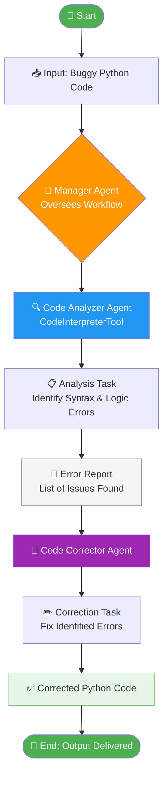

# 🐛 CrewAI Code Debugger

<p align="center">
  
  
  
  
  
  
</p>

A multi-agent system built with **CrewAI** that automatically detects and fixes errors in Python code. Two specialized agents — a Code Analyzer and a Code Corrector — work sequentially under a Manager agent to deliver clean, corrected code.

---

## 📚 Table of Contents

- [Overview](#-overview)
- [Workflow Diagram](#-workflow-diagram)
- [Project Structure](#-project-structure)
- [Agents](#-agents)
- [Tasks](#-tasks)
- [Example](#-example)
- [Setup & Installation](#-setup--installation)
- [Usage](#-usage)
- [Configuration](#-configuration)
- [License](#-license)

---

## 🧠 Overview

This project demonstrates a **sequential CrewAI pipeline** with planning enabled. Given a snippet of buggy Python code, the system:

1. Runs the code through a **Code Analyzer** agent (powered by `CodeInterpreterTool`) to detect all syntax and logical errors.
2. Passes the error report to a **Code Corrector** agent that returns a fully fixed, PEP-8 compliant version.
3. A **Manager** agent oversees the entire workflow, coordinating delegation and ensuring quality output.

---

## 🔀 Workflow Diagram



> The `.mmd` source file is located at [`Flow/workflow.mmd`](Flow/workflow.mmd).

---

## 📁 Project Structure

```
crewai-code-debugger/
├── Flow/
│   └── workflow.mmd            # Mermaid workflow diagram source
├── crewai_debugger.ipynb       # Main notebook — agents, tasks, and crew
├── requirements.txt            # Python dependencies
├── .env.example                # Environment variable template
├── .gitignore
├── LICENSE
└── README.md
```

---

## 🤖 Agents

| Agent | Role | Tool | Delegation |
|---|---|---|---|
| Code Analyzer | Identifies syntax & logical errors | `CodeInterpreterTool` | ❌ |
| Code Corrector | Fixes all identified errors | — | ❌ |
| Manager | Oversees and coordinates the pipeline | — | ✅ |

---

## 📋 Tasks

### 1. Analysis Task
- **Agent:** Code Analyzer
- **Tool:** `CodeInterpreterTool` — executes the code inside a Docker container to surface runtime and syntax errors
- **Output:** A numbered list of all errors with type, location, and description

### 2. Correction Task
- **Agent:** Code Corrector
- **Context:** Receives the error list from the Analysis Task via `context=[analysis_task]`
- **Output:** Complete, corrected Python code ready to run

---

## 💡 Example

### Input (Buggy Code)

```python
def fibonacci_iterative(n):
if n < 0:
return []
elif n == 1:
return [0]
elif n == 2:
return [0, 1]
fib_sequence = [0, 1]
for i in range(2, n):
next_fib = fib_sequence[-1] + fib_sequence[-2]
fib_sequence.append(next_fib)
return fib_sequence
```

### Expected Output (Corrected Code)

```python
def fibonacci_iterative(n):
    if n < 0:
        return []
    elif n == 1:
        return [0]
    elif n == 2:
        return [0, 1]
    fib_sequence = [0, 1]
    for i in range(2, n):
        next_fib = fib_sequence[-1] + fib_sequence[-2]
        fib_sequence.append(next_fib)
    return fib_sequence
```

---

## ⚙️ Setup & Installation

### Prerequisites

- Python 3.10+
- Docker Desktop (required by `CodeInterpreterTool` to execute code safely)
- An [OpenAI API key](https://platform.openai.com/account/api-keys) with an active billing plan

### Steps

```bash
# 1. Clone the repository
git clone https://github.com/SANJAI-s0/crewai-code-debugger.git
cd crewai-code-debugger

# 2. Create and activate a virtual environment
python -m venv .venv
source .venv/bin/activate        # Windows: .venv\Scripts\activate

# 3. Install dependencies
pip install -r requirements.txt

# 4. Configure environment variables
cp .env.example .env
# Edit .env and add your OPENAI_API_KEY
```

---

## 🚀 Usage

Open and run the notebook:

```bash
jupyter notebook crewai_debugger.ipynb
```

Run all cells top to bottom. The crew will execute sequentially:

1. Code Analyzer evaluates the buggy code and lists all errors.
2. Code Corrector applies fixes based on the error report.
3. The final corrected code is displayed in the Run the Pipeline cell.

To debug different code, update the `BUGGY_CODE` variable in **Cell 3**.

---

## 🔧 Configuration

| Variable | Description | Required |
|---|---|---|
| `OPENAI_API_KEY` | Your OpenAI API key (paid plan required) | ✅ |
| `OPENAI_MODEL_NAME` | Model to use (default: `gpt-4o`) | ❌ |

Set these in your `.env` file (use `.env.example` as a template).

> `CodeInterpreterTool` requires **Docker Desktop** to be running. Start it before executing the pipeline cell.

---

## 📄 License

This project is licensed under the [MIT License](LICENSE).
