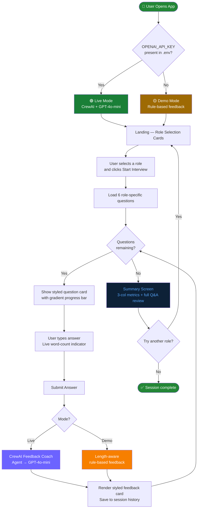

# 🎙️ CrewAI Role-Based AI Interviewer

<p align="center">
  
  
  
  
  
  
</p>

<p align="center">
  A role-specific AI mock interview simulator built with <strong>CrewAI</strong> and <strong>Streamlit</strong>.<br/>
  Pick a job role, answer 6 curated questions, and get instant AI-powered feedback — all in a polished dark UI.
</p>

<p align="center">
  <strong>Works fully without an API key.</strong> Add one to unlock live GPT-4o-mini feedback via CrewAI.
</p>

---

## 📋 Table of Contents

- [Overview](#-overview)
- [Demo vs Live Mode](#-demo-vs-live-mode)
- [UI Screens](#-ui-screens)
- [Features](#-features)
- [Supported Roles](#-supported-roles)
- [Workflow](#-workflow)
- [Project Structure](#-project-structure)
- [Getting Started](#-getting-started)
- [How It Works](#-how-it-works)
- [CrewAI Agent](#-crewai-agent)
- [Tech Stack](#-tech-stack)
- [License](#-license)

---

## 🧠 Overview

This project extends a basic CrewAI mock interviewer into a **role-specific** interview simulator. It supports four job roles — Data Scientist, Web Developer, Product Manager, and UI/UX Designer — each with 6 hand-crafted questions.

The app auto-detects whether an OpenAI API key is present and switches between Demo Mode (rule-based feedback, zero API calls) and Live Mode (CrewAI Feedback Coach agent powered by GPT-4o-mini). Mentors running the app with a valid key get full AI feedback automatically.

---

## 🔀 Demo vs Live Mode

| | 🟡 Demo Mode | 🟢 Live Mode |
|---|---|---|
| API key required | No | Yes — `OPENAI_API_KEY` in `.env` |
| Feedback engine | Length-aware rule-based logic | CrewAI agent → GPT-4o-mini |
| All UI features | ✅ Full | ✅ Full |
| API calls made | ❌ None | ✅ Per answer |
| Sidebar badge | 🟡 Demo Mode | 🟢 Live Mode |

The mode is detected at startup — no code changes needed to switch between them.

---

## 🖥️ UI Screens

### Screen 1 — Landing & Role Selection
- Centered hero title and subtitle
- 2×2 interactive role card grid — each card shows an icon, role name, and skill tag
- Selected card highlights with a role-specific color glow border
- Sidebar displays "How it works" steps and the list of available roles
- Confirm selection and start with a single button click

### Screen 2 — Interview
- Role icon + name header
- Gradient progress bar (`#6C63FF → #00B4D8`) tracking question completion
- Styled question card with a role-color left border accent
- Answer textarea with a **live word-count indicator** — turns green in the ideal 30–120 word range
- Collapsible "Previous answers" panel showing all completed Q&A with feedback
- Sidebar updates live with role, answered count, and % progress
- Sidebar restart button available at any point

### Screen 3 — Summary
- Gradient completion banner (green) with role and question count
- 3-column metrics strip: total questions · average answer length · role
- Full expandable session review — every question with your answer and a styled blue AI feedback card
- "Try Another Role" button to restart cleanly

---

## ✨ Features

- 🎨 Dark theme — custom CSS, Inter font, `#0f1117` base, gradient accents throughout
- 🃏 Interactive role cards — color-coded per role with hover lift and selection glow
- 📏 Live word-count guide — real-time feedback on answer length as you type
- 📊 Live sidebar stats — role, answered count, progress % update after each submission
- 💬 Styled feedback cards — blue gradient panel visually separates AI feedback from answers
- 📖 Collapsible history — previous Q&A stays accessible without cluttering the active question
- 🏁 Summary metrics — question count, average word count, role displayed as st.metric cards
- 🔄 Restart anywhere — from sidebar during interview or from the summary screen
- 🟡/🟢 Mode badge — always visible in sidebar so it's clear which mode is active

---

## 💼 Supported Roles

| Role | Icon | Color | Focus Areas |
|------|------|-------|-------------|
| Data Scientist | 🧠 | `#6C63FF` | ML · Statistics · Modelling |
| Web Developer | 💻 | `#00B4D8` | APIs · Frontend · HTTP |
| Product Manager | 📋 | `#F77F00` | Strategy · Metrics · Roadmap |
| UI/UX Designer | 🎨 | `#E63946` | Design · Research · Accessibility |

---

## 🔄 Workflow



> Full `.mmd` source: [`Flow/workflow.mmd`](Flow/workflow.mmd)

---

## 📁 Project Structure

```
crewai-role-based-ai-interviewer/
│
├── app.py                  # All-in-one Streamlit app
│                           #   · Role config & questions
│                           #   · Demo / Live feedback logic
│                           #   · Custom CSS theme
│                           #   · Landing, Interview, Summary screens
│
├── requirements.txt        # Python dependencies
├── .env.example            # API key template — copy to .env
├── .gitignore              # Ignores .env, __pycache__, .venv, etc.
├── LICENSE                 # MIT License
├── README.md               # This file
│
└── Flow/
    └── workflow.mmd        # Mermaid source for the workflow diagram
```

---

## 🚀 Getting Started

### Prerequisites

- Python 3.10 or higher
- _(Optional)_ An [OpenAI API key](https://platform.openai.com/api-keys) for Live Mode

### Installation

**1. Clone the repo**

```bash
git clone https://github.com/SANJAI-s0/crewai-role-based-ai-interviewer.git
cd crewai-role-based-ai-interviewer
```

**2. Create a virtual environment**

```bash
python -m venv .venv

# Windows
.venv\Scripts\activate

# macOS / Linux
source .venv/bin/activate
```

**3. Install dependencies**

```bash
pip install -r requirements.txt
```

**4. Set up your API key** _(skip this for Demo Mode)_

```bash
cp .env.example .env
```

Edit `.env`:
```env
OPENAI_API_KEY=sk-...your-key-here...
```

**5. Run the app**

```bash
streamlit run app.py
```

Opens at `http://localhost:8501`.

---

## ⚙️ How It Works

**1. Mode detection**
On startup, the app reads `OPENAI_API_KEY` from `.env`. If a valid key is found, `LIVE_MODE = True` and a 🟢 badge appears in the sidebar. Otherwise, 🟡 Demo Mode is used — no API calls are ever made.

**2. Role selection**
The landing page renders 4 role cards in a 2×2 grid. Clicking a card highlights it with a role-specific color glow. The selected role and its skill tags are confirmed below before starting.

**3. Interview loop**
Questions are shown one at a time. A gradient progress bar tracks completion. As the user types, a live word-count indicator turns green when the answer is in the ideal 30–120 word range.

**4. Feedback**
- _Live Mode_: `get_live_feedback()` lazily imports CrewAI and LangChain, builds a `Feedback Coach` agent, runs a single-task Crew, and returns 2-3 sentences of constructive feedback.
- _Demo Mode_: `get_demo_feedback()` checks word count and returns a contextual response from a curated pool — no imports, no API calls.

**5. Summary**
After all 6 questions, a summary screen shows a completion banner, a 3-column metrics strip, and a full expandable review of every Q&A with styled feedback cards.

---

## 🤖 CrewAI Agent

Used only in Live Mode. Instantiated lazily — never created when running in Demo Mode.

```python
Agent(
    role="Interview Feedback Coach",
    goal="Provide concise, constructive feedback on interview answers",
    backstory=(
        "You are an experienced hiring manager and interview coach. "
        "You give short, honest, and encouraging feedback. Keep it to 2-3 sentences."
    ),
    llm=ChatOpenAI(model="gpt-4o-mini", temperature=0.7),
)
```

Each submitted answer creates a `Task` for this agent and runs it through a single-agent `Crew`. The result is rendered in a styled blue feedback card.

---

## 🛠️ Tech Stack

| Technology | Version | Purpose |
|------------|---------|---------|
| [Streamlit](https://streamlit.io/) | ≥ 1.35 | Web UI, session state, custom CSS |
| [CrewAI](https://github.com/joaomdmoura/crewAI) | ≥ 0.28 | Multi-agent orchestration (Live Mode) |
| [LangChain OpenAI](https://python.langchain.com/) | ≥ 0.1 | LLM wrapper for GPT-4o-mini |
| [OpenAI](https://platform.openai.com/) | ≥ 1.30 | GPT-4o-mini API (Live Mode) |
| [python-dotenv](https://pypi.org/project/python-dotenv/) | ≥ 1.0 | `.env` file loading |

---

## 📄 License

This project is licensed under the [MIT License](LICENSE).
