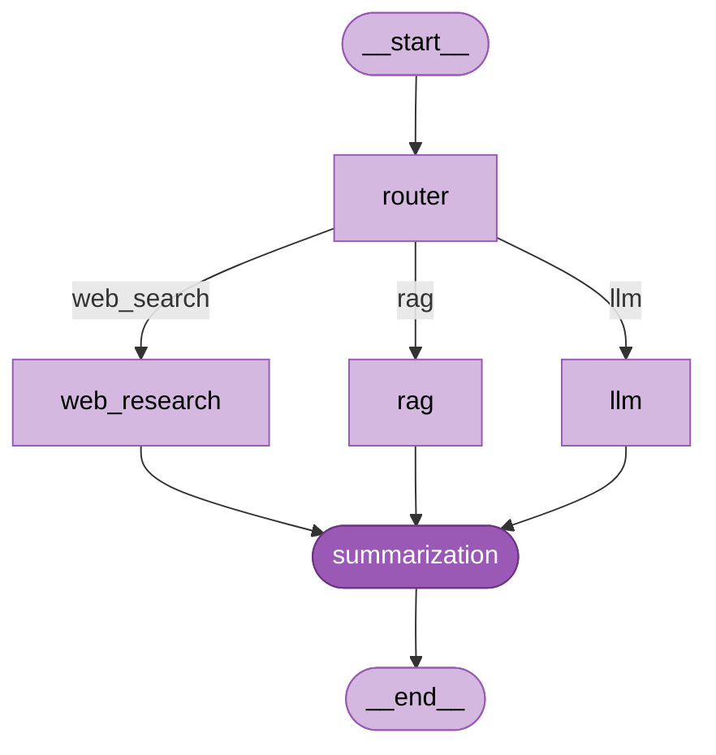

# 🤖 LangGraph Multi-Agent Research & Summarization System

[](https://www.python.org/)
[](https://langchain-ai.github.io/langgraph/)
[](https://www.langchain.com/)
[](https://console.groq.com/)
[](https://faiss.ai/)
[](LICENSE)

A stateful, multi-agent AI system built with **LangGraph** that intelligently routes user queries to specialized agents — web research, RAG retrieval, or direct LLM reasoning — and synthesizes a structured final response.

---

## 📑 Table of Contents

- [Overview](#-overview)
- [System Architecture](#-system-architecture)
- [Agent Descriptions](#-agent-descriptions)
- [Graph Flow & Decision Making](#-graph-flow--decision-making)
- [Project Structure](#-project-structure)
- [Setup & Installation](#-setup--installation)
- [Usage](#-usage)
- [Test Queries & Results](#-test-queries--results)
- [Memory & Conversational AI](#-memory--conversational-ai)
- [License](#-license)

---

## 🧠 Overview

This project implements a **Multi-Agent Research and Summarization System** using [LangGraph](https://langchain-ai.github.io/langgraph/). The system processes user queries by:

1. Classifying the query type via a **Router Agent**
2. Dispatching to the most appropriate specialized agent
3. Synthesizing a clean, structured answer via a **Summarization Agent**

The LLM backbone is **LLaMA 3.3-70B** served through [Groq](https://console.groq.com/) for fast inference. The RAG knowledge base is an in-memory **FAISS** vector store populated with AI/ML domain documents, embedded using `sentence-transformers/all-MiniLM-L6-v2`.

---

## 🏗️ System Architecture

```
                        User Query
                            │
                            ▼
                     ┌─────────────┐
                     │   Router    │  ← Classifies query type
                     │   Agent     │
                     └──────┬──────┘
                            │
              ┌─────────────┼──────────────┐
              ▼             ▼              ▼
        ┌──────────┐ ┌──────────┐ ┌──────────────┐
        │   LLM    │ │   RAG    │ │ Web Research │
        │  Agent   │ │  Agent   │ │    Agent     │
        │(general) │ │(dataset) │ │  (current)   │
        └────┬─────┘ └────┬─────┘ └──────┬───────┘
             │            │              │
             └────────────┼──────────────┘
                          ▼
                  ┌───────────────┐
                  │ Summarization │  ← Synthesizes final answer
                  │    Agent      │
                  └───────────────┘
                          │
                          ▼
                   Final Response
```

### Mermaid Workflow Diagram



> The full `.mmd` source is at [`Flow/workflow.mmd`](Flow/workflow.mmd).

---

## 🤖 Agent Descriptions

| Agent | Role | Trigger Condition |
|---|---|---|
| **Router Agent** | Classifies the query and directs it to the right agent | Always runs first |
| **Web Research Agent** | Fetches live / current information | Keywords: `latest`, `current`, `today`, `recent`, `2024`, `2025`, `trending`, etc. |
| **RAG Agent** | Semantic retrieval from FAISS vector store (AI/ML knowledge base) | Keywords: `machine learning`, `transformer`, `LLM`, `RAG`, `LangGraph`, `overfitting`, etc. |
| **LLM Agent** | Answers general knowledge / reasoning questions directly | Fallback when no keywords match |
| **Summarization Agent** | Synthesizes and structures the final response | Always runs last |

---

## 🔄 Graph Flow & Decision Making

The LangGraph `StateGraph` uses a shared `AgentState` TypedDict as the single source of truth across all nodes.

**Routing logic (conditional edge):**

```
query contains time-sensitive keywords  →  web_search node
query contains AI/ML domain keywords   →  rag node
no keywords match                       →  llm node (fallback)
```

All three paths converge at the `summarization` node, which uses the LLM to produce a polished, well-structured final answer. Conversation history (`chat_history`) is maintained in state and injected into the LLM agent for multi-turn memory.

**State schema:**

```python
class AgentState(TypedDict):
    query: str                        # Original user question
    route: Optional[str]              # Routing decision: 'llm' | 'rag' | 'web_search'
    retrieved_context: Optional[str]  # Raw info from the selected agent
    final_response: Optional[str]     # Polished answer from summarization agent
    chat_history: List[dict]          # Past (query, response) turns for memory
    agent_trace: List[str]            # Log of agents invoked (transparency)
```

---

## 📁 Project Structure

```
langgraph-research-agent/
├── Flow/
│   └── workflow.mmd                              # Mermaid graph source
├── Project/
│   └── LangGraph Assignment_...pdf               # Original assignment brief
├── multi-agent_R&S_using_LangGraph.ipynb         # Main notebook
├── .env                                          # Your local API keys (git-ignored)
├── .env.example                                  # Environment variable template
├── .gitignore
├── LICENSE
├── README.md
└── requirements.txt
```

---

## ⚙️ Setup & Installation

**1. Clone the repository**

```bash
git clone https://github.com/SANJAI-s0/langgraph-research-agent.git
cd langgraph-research-agent
```

**2. Create and activate a virtual environment**

```bash
python -m venv .venv
# Windows
.venv\Scripts\activate
# macOS / Linux
source .venv/bin/activate
```

**3. Install dependencies**

```bash
pip install -r requirements.txt
```

**4. Configure your API key**

```bash
cp .env.example .env
# Open .env and replace the placeholder with your actual Groq API key
```

```env
GROQ_API_KEY=gsk_your_actual_key_here
```

Get a free Groq API key at [console.groq.com](https://console.groq.com/).

> The notebook uses `python-dotenv` to automatically load `.env` — no manual `os.environ` edits needed.

---

## 🚀 Usage

Open the notebook and run all cells sequentially:

```bash
jupyter notebook "multi-agent_R&S_using_LangGraph.ipynb"
```

Or run a quick query programmatically after building the graph:

```python
config = {"configurable": {"thread_id": "session-1"}}

result = research_agent.invoke(
    {
        "query": "What is Retrieval-Augmented Generation?",
        "chat_history": [],
        "agent_trace": [],
    },
    config=config,
)

print(result["final_response"])
```

---

## 🧪 Test Queries & Results

### Query 1 — RAG path

**Input:** `"What is Retrieval-Augmented Generation?"`

**Router decision:** `rag` (keyword: `retrieval-augmented generation`)

**Retrieved context (FAISS):**
> Retrieval-Augmented Generation (RAG) combines a retrieval system with a generative LLM. The retriever fetches relevant documents from a knowledge base; the LLM then generates an answer grounded in those documents. RAG reduces hallucinations and allows LLMs to access up-to-date or proprietary information.

**Final response (summarized):**
> Based on the knowledge base, Retrieval-Augmented Generation (RAG) is a technique that pairs a document retriever with a generative LLM. Instead of relying solely on parametric memory, the model grounds its answers in retrieved documents — reducing hallucinations and enabling access to proprietary or up-to-date information.

---

### Query 2 — Web Research path

**Input:** `"What are the latest AI developments in 2025?"`

**Router decision:** `web_search` (keywords: `latest`, `2025`)

**Retrieved context (simulated web):**
> • Google DeepMind released Gemini 2.0 Ultra with multimodal reasoning capabilities (Jan 2025)
> • OpenAI launched GPT-5 with improved long-context understanding and tool use (Feb 2025)
> • Meta released LLaMA 4 as open-source, outperforming previous closed models on benchmarks

**Final response (summarized):**
> Based on recent web data, 2025 has seen major AI milestones: Gemini 2.0 Ultra, GPT-5, and the open-source LLaMA 4 have all launched, pushing the frontier of multimodal reasoning and long-context understanding. Enterprise AI agent adoption is also accelerating.

---

### Query 3 — LLM path

**Input:** `"Explain the difference between supervised and unsupervised learning"`

**Router decision:** `llm` (no specific keywords matched)

**Final response (summarized):**
> Supervised learning trains a model on labeled data — each input has a known output — making it suitable for classification and regression tasks. Unsupervised learning finds hidden patterns in unlabeled data, used for clustering and dimensionality reduction. The key distinction is whether ground-truth labels are available during training.

---

## 💾 Memory & Conversational AI

The system uses LangGraph's `MemorySaver` checkpointer to persist `AgentState` across turns within a session. The `LLM Agent` injects the last 3 conversation turns as `HumanMessage` / `AIMessage` pairs, enabling coherent follow-up questions without re-stating context.

```python
# Each session is identified by a thread_id
config = {"configurable": {"thread_id": "user-session-42"}}
```

---

## 📄 License

This project is licensed under the [MIT License](LICENSE).
