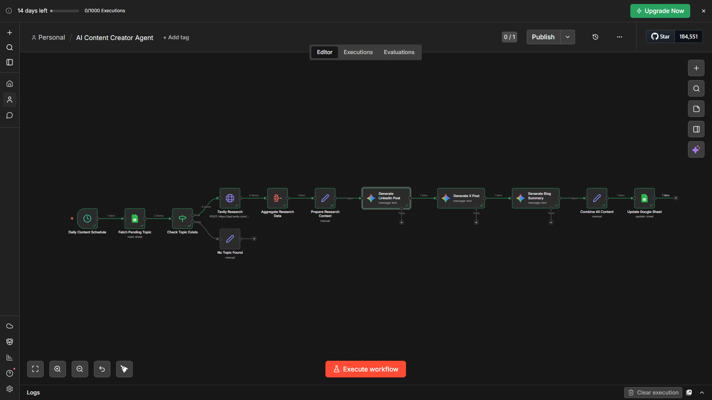

# AI-Powered Content Creator Agent — n8n Workflow

[](https://github.com/SANJAI-s0/n8n-ai-content-creator-agent)


---

## Table of Contents

1. [Project Objective](#1-project-objective)
2. [Workflow Screenshot](#2-workflow-screenshot)
3. [Folder Structure](#3-folder-structure)
4. [How the Workflow Works](#4-how-the-workflow-works)
5. [Node-by-Node Breakdown](#5-node-by-node-breakdown)
6. [API Keys Used](#6-api-keys-used)
7. [Google Sheet Structure](#7-google-sheet-structure)
8. [Sample Input & Generated Outputs](#8-sample-input--generated-outputs)
9. [Prompt Design Explanation](#9-prompt-design-explanation)
10. [Setup & Installation Guide](#10-setup--installation-guide)
11. [Evaluation Criteria Mapping](#11-evaluation-criteria-mapping)
12. [License](#12-license)

---

## 1. Project Objective

This project implements a **no-code AI-powered content creator agent** using [n8n](https://n8n.io/). The agent automates the complete end-to-end pipeline of:

- Fetching a pending content topic from a Google Sheet
- Conducting real-time web research using the Tavily Search API
- Generating three platform-specific pieces of content using **Gemini 2.5 Flash** (Google):
  - A professional **LinkedIn post**
  - A concise, engaging **X (Twitter) post**
  - A comprehensive **blog summary** (250–350 words)
- Writing all generated content back to the Google Sheet and marking the topic as `Completed`

The workflow runs fully autonomously on a daily schedule — no manual intervention required after initial setup.

---

## 2. Workflow Screenshot



The workflow follows a linear pipeline with one conditional branch for graceful error handling when no pending topics are found.

---

## 3. Folder Structure

```
n8n/
├── AI_Content_Creator_Agent-GeminiAI.json  ← Exported n8n workflow (Gemini)
├── AI Content Creator Agent.json           ← Previous workflow (OpenAI/GPT-4o-mini)
├── README.md                               ← This file
├── LICENSE                                 ← MIT License
├── .gitignore
├── docs/
│   └── n8n_WorkFlow.png                    ← Workflow screenshot
└── Flow/
    └── workflow.mmd                        ← Mermaid diagram of the workflow
```

---

## 4. How the Workflow Works

The workflow is triggered automatically every day at **9:00 AM** via a Schedule Trigger node. The workflow is currently **inactive** (`active: false` — activate it after configuring credentials).

```
[Daily Content Schedule — Schedule Trigger @ 9:00 AM]
      ↓
[Fetch Pending Topic — Google Sheets Read (sheet: n8n, gid=0)]
      ↓
[Check Topic Exists — IF $json['Topic '] exists]
     ↙                        ↘
[TRUE: Tavily Research]     [FALSE: No Topic Found — Exit]
      ↓
[Aggregate Research Data — aggregate results field → research_data[]]
      ↓
[Prepare Research Context — topic + research_summary (with fallback)]
      ↓
[Generate LinkedIn Post — Gemini 2.5 Flash, temp=0.7, maxOutputTokens=1000]
      ↓
[Generate X Post — Gemini 2.5 Flash, temp=0.8, maxOutputTokens=200]
      ↓
[Generate Blog Summary — Gemini 2.5 Flash, temp=0.7, maxOutputTokens=2048]
      ↓
[Combine All Content — Set: Topic, Status=Completed, LinkedIn_Post, X_Post, Blog_Summary, Published_Date, row_number]
      ↓
[Update Google Sheet — update operation, match by Topic ]
```

---

## 5. Node-by-Node Breakdown

| # | Node Name | Type | Description |
|---|-----------|------|-------------|
| 1 | **Daily Content Schedule** | Schedule Trigger | Fires every day at 9:00 AM automatically |
| 2 | **Fetch Pending Topic** | Google Sheets (Read) | Reads all rows from the configured sheet; filter `Status = Pending` must be set after import |
| 3 | **Check Topic Exists** | IF | Checks if `Topic` field is non-empty; routes to research (true) or graceful exit (false) |
| 4 | **Tavily Research** | HTTP Request (POST) | Calls `https://api.tavily.com/search` with `search_depth: advanced` and `max_results: 5` |
| 5 | **Aggregate Research Data** | Aggregator | Aggregates only the `results` field from Tavily response into a `research_data` array |
| 6 | **Prepare Research Context** | Set | Extracts `topic` from first sheet row; maps `results[].title + content` into `research_summary`. Falls back to `"No research data available"` if empty |
| 7 | **Generate LinkedIn Post** | Google Gemini 2.5 Flash | Generates a professional LinkedIn post; output at `content.parts[0].text`; temp=0.7, maxOutputTokens=1000 |
| 8 | **Generate X Post** | Google Gemini 2.5 Flash | Generates a tweet under 280 characters; temp=0.8, maxOutputTokens=200 |
| 9 | **Generate Blog Summary** | Google Gemini 2.5 Flash | Generates a comprehensive 250–350 word blog summary; temp=0.7, maxOutputTokens=2048 |
| 10 | **Combine All Content** | Set | Assembles Topic, Status=Completed, LinkedIn_Post, X_Post, Blog_Summary, Published_Date, row_number; reads Gemini output via `content.parts[0].text` |
| 11 | **Update Google Sheet** | Google Sheets (Update) | Updates the row matched by `Topic ` column; writes all generated content back to the sheet |
| 12 | **No Topic Found** | Set | Outputs a message `"No pending topics found in the sheet"` — graceful no-op exit |

---

## 6. API Keys Used

> **Do not include actual API key values.** Configure all keys inside n8n's credential manager.

| Service | Purpose | Credential Type in n8n |
|---------|---------|------------------------|
| **Google Gemini API** (`GOOGLE_GEMINI_API_KEY`) | Powers Gemini 2.5 Flash for all three content generation nodes | Google Gemini (PaLM) API credential |
| **Tavily Search API** (`TAVILY_API_KEY`) | Real-time web research on the given topic | HTTP Header Auth — **move the key out of the JSON body into n8n credentials before sharing** |
| **Google Sheets OAuth2** | Read pending topics and write generated content back | Google OAuth2 credential |

### Where to Get These Keys

- **Google Gemini**: [https://aistudio.google.com/app/apikey](https://aistudio.google.com/app/apikey) — free tier available
- **Tavily**: [https://app.tavily.com](https://app.tavily.com) — free tier available
- **Google Sheets**: Enable Google Sheets API in [Google Cloud Console](https://console.cloud.google.com/) and create OAuth2 credentials

---

## 7. Google Sheet Structure

Create a Google Sheet with the following exact column headers (case-sensitive):

| Topic | Status | LinkedIn_Post | X_Post | Blog_Summary | Published_Date |
|-------|--------|---------------|--------|--------------|----------------|
| The Rise of Agentic AI in 2025 | Pending | | | | |
| AI in Healthcare | Pending | | | | |
| Quantum Computing Breakthroughs | Pending | | | | |
| Future of Remote Work | Pending | | | | |

**Column Descriptions:**

- `Topic` — The keyword or subject to research and write about
- `Status` — Set to `Pending` for new topics; workflow updates to `Completed` after processing
- `LinkedIn_Post` — Auto-filled by the workflow with the generated LinkedIn content
- `X_Post` — Auto-filled with the generated tweet
- `Blog_Summary` — Auto-filled with the 150–200 word blog summary
- `Published_Date` — Auto-filled with today's date in `yyyy-MM-dd` format

---

## 8. Sample Input & Generated Outputs

### Input Topic

```
The Rise of Agentic AI in 2025
```

---

### Generated LinkedIn Post

```
The way we build software is fundamentally changing — and Agentic AI is at the center of it.

In 2025, AI agents don't just respond to prompts. They plan multi-step tasks, execute autonomously, 
and self-correct when things go wrong. From coding assistants that ship features end-to-end, to 
research agents that synthesize reports in minutes — the shift from reactive to proactive AI is here.

Key takeaways for professionals:
→ Agentic workflows reduce human-in-the-loop bottlenecks by up to 60%
→ Frameworks like CrewAI, LangGraph, and AutoGen are now production-ready
→ Organizations adopting agentic AI report 3x faster delivery cycles

The question is no longer whether to adopt agentic AI — it's how quickly you can integrate it 
into your existing workflows.

What's the first process in your organization you'd hand off to an AI agent?

#AgenticAI #AIAutomation #FutureOfWork
```

> Word count: ~155 words | Tone: Professional, conversational | Ends with engagement question ✓

---

### Generated X (Twitter) Post

```
🤖 Agentic AI isn't the future — it's already 2025.

AI agents now plan, act & self-correct without hand-holding.
Businesses using them are moving 3x faster.

Are you still doing manually what an agent could handle?

#AgenticAI #AIAutomation
```

> Character count: ~230 (under 280 limit) ✓ | Includes emoji ✓ | 2 hashtags ✓

---

### Generated Blog Summary

```
The Rise of Agentic AI in 2025

Artificial intelligence has crossed a pivotal threshold. Where earlier AI systems simply responded 
to prompts, today's agentic AI systems proactively plan, execute multi-step tasks, and self-correct 
— all with minimal human oversight. This shift is not incremental; it represents a fundamental 
rethinking of how software and automation work.

## What Makes AI "Agentic"?

Agentic AI refers to systems that can autonomously pursue goals across multiple steps, tools, and 
decisions. Unlike traditional AI that waits for instructions, agents observe their environment, 
form plans, take actions, and adapt based on outcomes. Frameworks like CrewAI, LangGraph, and 
AutoGen have made this accessible to developers at scale.

## The Business Impact

In 2025, enterprises are deploying agents across software development, customer support, financial 
analysis, and content creation pipelines. Research indicates that organizations adopting agentic 
workflows report up to 60% reduction in manual bottlenecks and 3x faster delivery cycles. Early 
adopters in fintech and e-commerce are already reporting measurable ROI within the first quarter 
of deployment.

## Reliability and Guardrails

A common concern is unpredictability. Modern agents address this by operating within defined 
guardrails, logging their reasoning chains, and escalating edge cases to human reviewers. This 
makes them reliable partners rather than unpredictable black boxes — a critical requirement for 
enterprise adoption.

## Key Takeaways

- Agentic AI is production-ready in 2025, not just experimental
- Multi-agent frameworks reduce human bottlenecks by up to 60%
- Guardrails and reasoning logs make agents enterprise-safe
- The competitive gap between early and late adopters is widening fast

The era of passive AI tools is over. Organizations that integrate agentic workflows now will 
compound their advantage as the technology matures through 2025 and beyond.
```

> Word count: ~280 words ✓ | Structure: Intro → Subheadings → Takeaways → Conclusion ✓ | Data-backed ✓

---

## 9. Prompt Design Explanation

Each of the three Google Gemini nodes uses a carefully crafted **system prompt** that defines the AI's role, constraints, and output format. Here's the reasoning behind each design:

---

### LinkedIn Prompt Design

**System Prompt used:**
```
You are a professional LinkedIn content creator. Create engaging, professional posts that:
- Start with a compelling hook
- Use clear paragraphs with line breaks
- Include relevant insights and actionable takeaways
- End with a thought-provoking question
- Use 2-3 relevant hashtags
- Keep it between 150-200 words
- Maintain a professional yet conversational tone
```

**Design Rationale:**
- LinkedIn rewards posts that open with a strong hook — the first line determines whether users click "see more"
- Paragraph breaks improve readability in the LinkedIn feed
- Ending with a question drives comments and boosts algorithmic reach
- 150–200 words is the LinkedIn sweet spot — long enough to add value, short enough to retain attention
- `temperature: 0.7` balances creativity with coherence; `maxOutputTokens: 1000` gives Gemini room for the full post
- Model used: `gemini-2.5-flash`

---

### X (Twitter) Prompt Design

**System Prompt used:**
```
You are a social media expert for X (Twitter). Create concise, engaging posts that:
- Are under 280 characters
- Start with a strong hook or insight
- Use 1-2 relevant hashtags
- Include an emoji for visual appeal
- Are punchy and shareable
- Drive engagement
```

**Design Rationale:**
- The 280-character hard limit is enforced explicitly in the prompt to prevent truncation issues
- Emojis increase visual scan-ability in a fast-moving feed
- A punchy opening line is critical on X — users scroll fast and decide in under a second
- `temperature: 0.8` is slightly higher to encourage more creative, viral-style phrasing
- `maxOutputTokens: 200` keeps the output tight and prevents the model from over-generating
- Model used: `gemini-2.5-flash`

---

### Blog Summary Prompt Design

**System Prompt used:**
```
You are a professional blog writer. Create comprehensive, informative blog summaries that:
- Are 250-350 words minimum (aim for detailed content)
- Have a clear introduction that hooks the reader
- Include multiple paragraphs covering different aspects of the topic
- Incorporate specific insights, data points, and examples from the research
- Use subheadings or clear topic transitions
- Provide actionable takeaways or key learnings
- End with a strong conclusion or call-to-action
- Use a professional yet accessible tone
- Make full use of the research context provided - do not summarize briefly, expand on the details
```

**Design Rationale:**
- Expanded to 250–350 words (vs. 150–200 in the OpenAI version) to produce richer, more detailed blog content
- Explicitly instructs Gemini to "make full use of the research context" — prevents shallow summaries
- Subheadings and topic transitions improve scannability for blog readers
- Actionable takeaways add practical value beyond just summarizing facts
- `maxOutputTokens: 2048` gives Gemini full room to expand on the research data
- `temperature: 0.7` keeps the output factual and coherent
- Model used: `gemini-2.5-flash`

---

### User Message Pattern (All Three Nodes)

All three nodes pass the same structured user message:

```
Topic: {topic}

Research Context:
{research_summary}

Create a [LinkedIn post / tweet / blog summary] about this topic.
```

This ensures the AI always has:
1. A clear subject to write about
2. Real, up-to-date factual context from Tavily to ground its output
3. An explicit instruction on what format to produce

---

## 10. Setup & Installation Guide

### Prerequisites

- n8n instance (cloud at [n8n.io](https://n8n.io) or self-hosted via Docker)
- Google account with Google Sheets API enabled
- Google Gemini API key (free tier at [aistudio.google.com](https://aistudio.google.com/app/apikey))
- Tavily account (free tier works)

### Step-by-Step Setup

**Step 1 — Import the Workflow**
1. Clone the repository:
   ```bash
   git clone https://github.com/SANJAI-s0/n8n-ai-content-creator-agent.git
   ```
2. Open your n8n instance
3. Click `+` → `Import from file`
4. Select `AI_Content_Creator_Agent-GeminiAI.json`
5. The workflow will load with all nodes pre-configured

**Step 2 — Configure Google Sheets Credential**
1. Go to n8n Settings → Credentials → New
2. Select `Google Sheets OAuth2`
3. Follow the OAuth flow to connect your Google account
4. Assign this credential to both `Fetch Pending Topic` and `Update Google Sheet` nodes

**Step 3 — Configure Google Gemini Credential**
1. Go to Credentials → New → `Google Gemini(PaLM) API`
2. Paste your Gemini API key from [https://aistudio.google.com/app/apikey](https://aistudio.google.com/app/apikey)
3. Assign to all three Gemini nodes: `Generate LinkedIn Post`, `Generate X Post`, `Generate Blog Summary`

**Step 4 — Configure Tavily Credential**
1. Go to Credentials → New → `HTTP Header Auth`
2. Set Header Name: `Authorization`
3. Set Header Value: `Bearer YOUR_TAVILY_API_KEY`
4. Assign to the `Tavily Research` node

**Step 5 — Set Up Google Sheet**
1. The workflow is already connected to a Google Sheet named **`n8n`** (sheet tab: `gid=0`). If using your own sheet, update the Document ID in both `Fetch Pending Topic` and `Update Google Sheet` nodes.
2. Ensure your sheet has these exact columns: `Topic ` *(note the trailing space)*, `Status `, `LinkedIn_Post `, `X_Post`, `Blog_Summary`, `Published_Date`
3. The `Update Google Sheet` node matches rows by `Topic ` column value — ensure topics are unique in your sheet.
4. Add topics with `Status = Pending` to your sheet. The `Check Topic Exists` IF node checks that `Topic ` is non-empty to decide whether to proceed.

> **Security note:** The Tavily API key is currently embedded directly in the `Tavily Research` node's JSON body. Before sharing or publishing this workflow, move it to an n8n HTTP Header Auth credential and reference it via `$credentials`.

**Step 6 — Activate the Workflow**
1. Click the toggle at the top right of the workflow to set it `Active`
2. The workflow will now run automatically every day at 9:00 AM
3. To test immediately, click `Test Workflow` manually

---

## 11. Evaluation Criteria Mapping

| Criteria | Weight | How This Project Addresses It |
|----------|--------|-------------------------------|
| **Workflow Completeness** | 30% | All components implemented: Schedule Trigger → Google Sheets input → Tavily research → Aggregation → 3x Gemini generation → Google Sheets output. 12 nodes, fully connected. |
| **Content Quality** | 25% | Gemini 2.5 Flash used with research-grounded prompts. Tavily provides real-time factual context, minimizing hallucinations. Blog output expanded to 250–350 words with subheadings for richer content. Each platform output is format-appropriate and coherent. |
| **Automation Logic** | 20% | Fully automated end-to-end. IF node handles the no-topic edge case gracefully. No manual steps required after activation. |
| **AI & Prompt Engineering** | 15% | Three distinct system prompts, each tailored to platform tone, length, and format. Temperature and maxOutputTokens tuned per use case. Research context injected into every prompt. Blog prompt significantly expanded to leverage Gemini's larger context window. |
| **Documentation & Clarity** | 10% | All nodes are clearly named. This README covers all required sections. Workflow diagram included in `Flow/workflow.mmd`. |

---

## 12. License

MIT License — see [LICENSE](LICENSE)
